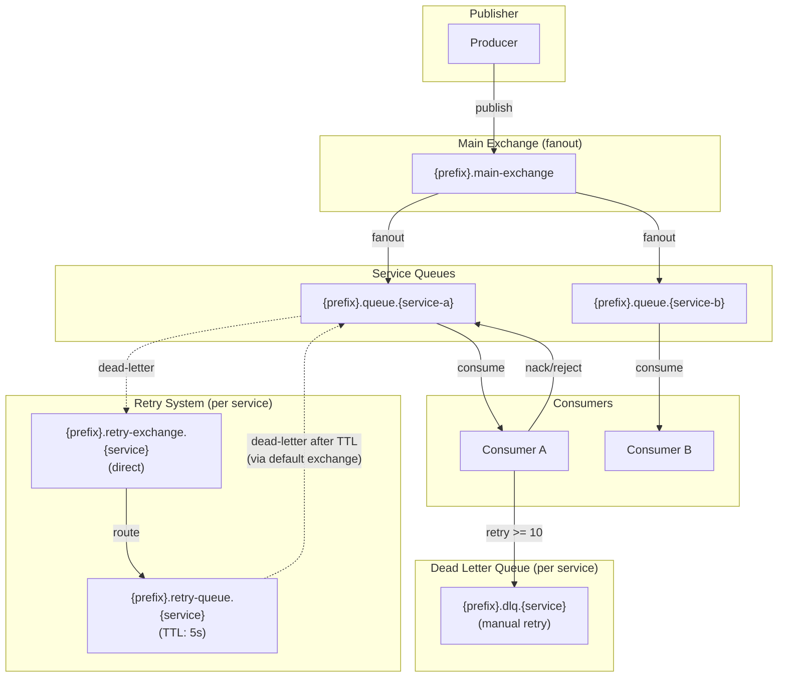

# RabbitMQ Architecture

This document describes the exchange and queue topology used by the event-bus RabbitMQ implementation.

## Naming Convention

All resources use a dynamic prefix derived from the service name (part before the first hyphen):
- `wms-cincout` → prefix: `wms`
- `xyz-service` → prefix: `xyz`
- `noprefix` → prefix: `default`

## Topology Flowchart

## Message Flow

### Happy Path
1. Producer publishes message to `{prefix}.main-exchange`
2. Exchange fans out message to all bound service queues
3. Consumer reads message from `{prefix}.queue.{service}`
4. Consumer acknowledges (ack) → message removed

### Retry Path (dead-letter)
Used for: 5xx errors, 429 (rate-limit), 409 (lock conflict)

1. Consumer returns `DROP` (nack with requeue=false)
2. Message dead-letters to `{prefix}.retry-exchange.{service}`
3. Retry exchange routes to `{prefix}.retry-queue.{service}`
4. Message sits in retry queue for 5 seconds (TTL)
5. After TTL expires, message dead-letters directly to `{prefix}.queue.{service}` (via default exchange)
6. Message is re-delivered only to the failed service (not fanned out to all services)
7. **Max 10 retries** - after 10 failed attempts, message is moved to `{prefix}.dlq.{service}` for manual retry (logged as `RABBITMQ_MESSAGE_MAX_RETRIES_EXCEEDED`)

### Delayed Message Path (local sleep)
Used for: 425 (too early - `processAfterDelayMs` not yet reached)

1. Consumer sleeps locally (randomDelay)
2. Consumer returns `REQUEUE` (nack with requeue=true)
3. Message returns to the same queue immediately for retry
4. This avoids multiple DLX cycles when delay exceeds 5s TTL

## Consumer Status Handling

| HTTP Status | ConsumerStatus | Behavior |
|-------------|----------------|----------|
| 2xx | `ACK` | Success, message removed |
| 429, 409 | `DROP` | Dead-letter retry (rate-limit/lock conflict) |
| 425 | `REQUEUE` | Local sleep + immediate requeue (delayed message) |
| 5xx | `DROP` | Dead-letter retry (transient error) |
| Other 4xx | `DROP` | Dead-letter (bad message, will likely fail again) |
| Exception | `DROP` | Dead-letter (consumer error) |
| Any (retry >= 10) | `ACK` | Max retries exceeded, message moved to DLQ |

## Queue Configuration

| Queue | Type | Dead-Letter Exchange | Dead-Letter Routing Key | TTL |
|-------|------|---------------------|------------------------|-----|
| `{prefix}.queue.{service}` | classic | `{prefix}.retry-exchange.{service}` | `retry` | - |
| `{prefix}.retry-queue.{service}` | classic | `""` (default) | `{prefix}.queue.{service}` | 5000ms |
| `{prefix}.dlq.{service}` | classic | - | - | - |

## Exchange Configuration

| Exchange | Type | Purpose |
|----------|------|---------|
| `{prefix}.main-exchange` | fanout | Distribute messages to all service queues |
| `{prefix}.retry-exchange.{service}` | direct | Route failed messages to retry queue (binding key: `retry`) |

## Dead Letter Queue (DLQ)

Messages that fail after 10 retry attempts are moved to `{prefix}.dlq.{service}` for manual inspection and retry.

### DLQ Message Headers

Messages in the DLQ include additional headers for debugging:

| Header | Description |
|--------|-------------|
| `x-original-queue` | The queue the message was consumed from |
| `x-final-status-code` | HTTP status code from last processing attempt (if applicable) |
| `x-final-error` | Error message from last processing attempt (if exception) |
| `x-final-retry-count` | Number of retry attempts before moving to DLQ |
| `x-death` | Standard RabbitMQ dead-letter history |

### Manual Retry

To retry messages from the DLQ:
1. Inspect messages in `{prefix}.dlq.{service}` queue
2. Fix the underlying issue (e.g., dependent service, data issue)
3. Move message back to `{prefix}.queue.{service}` for reprocessing
4. The `x-death` header will be preserved, so retry count continues from where it left off
